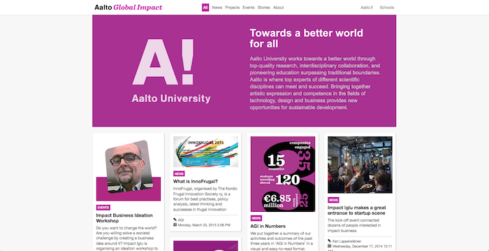

# Aalto OIP-Control Panel reimplementation
Aalto's OIP Control Panel (Open Innovation Platform) needed a new UI and improved experience. This prototype was implemented with Javascript, DustJS for templating and PHP.

About
-----
After joining the project and conferencing with the end users,  I quickly realised that besides a new look and feel there were a lot of functionality needs that were not yet addressed within the old implementation. These needs were taken into consideration, conceptualized, prototyped and user tested. Thus, the old Control Panel was overhauled to accommodate a CMS module to be able to control the information published to http://www.aaltoglobalimpact.org/, a file upload module, an internal communication module (commenting system) and a "news" and "events" widget. 

Old control panel
-----

Old control panel, editing mode
-----

New control panel
-----
An off-canvas navigation was agreed upon, in order to allow the users more working space. The "news" and "events" sections were implemented, as well as a "commenting" capability (within the content-card of each article)

New control panel (off-canvas options)
-----
The CMS module of the control panel was incorporated off-canvas. The "Manage Pages" section gives you access to the layout, where you can perform the necessary adjustments. Also the File Upload module was implemented here. 

New control panel, content editing mode
-----

aaltoglobalimpact.org (before)
-----

aaltoglobalimpact.org, article viewing (before)
-----

aaltoglobalimpact.org (after)
-----
The layout was reworked, and the content-card system reimplemented. Cleaner, more usable and responsive.

aaltoglobalimpact.org, article viewing (after)
-----
The information of each article was now easier to read and follow

